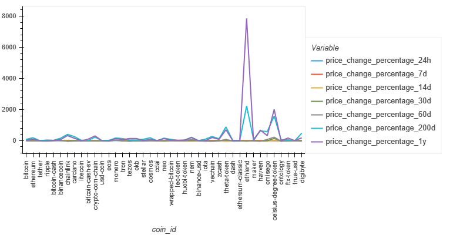
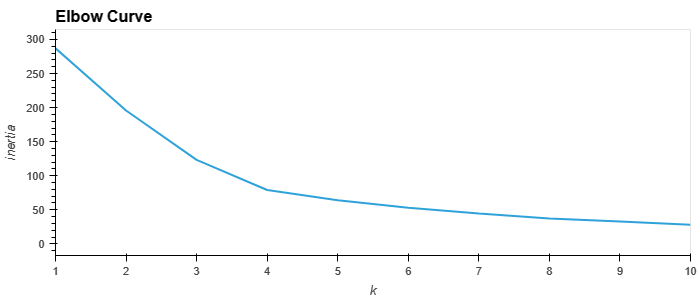
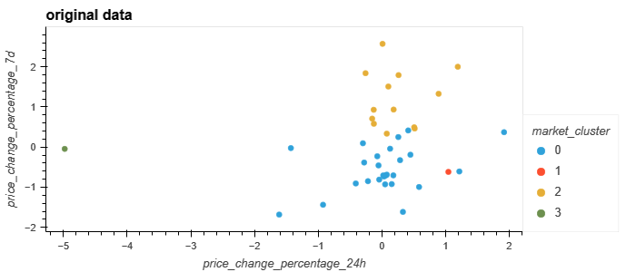
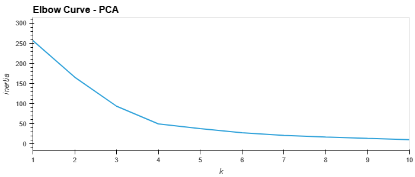
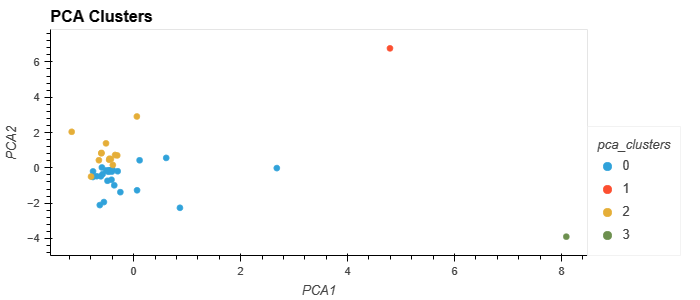

# Crypto-Clustering

## Welcome
Here you will find an analysis of Cryptocurrency data and price changes over various time periods.
We seek to show you the ideal number of groupings for understanding these datasets and the trends that might accompany them. 

To further break down this information into understandable groupings or clusters we conducted a kmeans analysis as well as a Principal Component Analysis.
 
First, We normalize the data using the Standard Scaler module found in the Scikit-Learn module for Python. 
Using this original data, we performed an elbow test to identify what the ideal number of clusters would be for this dataset. 
 

 
From a visual analysis, we can see the last significant change or "elbow" in the above graph falls at a 'k' value of 4.  
Next, with a k-value identified. We proceeded to do a kmeans analysis and obtain the following cluster distribution while comparing a 7-day price change to the 24-hour price change
 

 

(In the jupyter notebook file you will find an interactive hvplot of these graphs so you can highlight points to see which data points correspond with which cryptocurrencies.)
 
Next, we repeated these two steps, but using a Principal Component Analysis, to see if we can obtain clearer insights with optimized data.
 
Using the same elbow test, we can see the ideal k-value still remains to be 4 using PCA data. 
 

 
And then generating the clusters, you can see a similar the following figures:
 

 

## Conclusion
While both the original data and the PCA data provide very similar clusters. I believe the PCA data provides a slightly clearer group of data points to continue analysis. 
 
PCA data results in tighter clusters of data. and Clearly isolates two points that appear to be outliers in their own separate clusters. This allows you to continue the analysis with two clearly defined groups. 
The explained variance ratio is about 85% when looking at all 3 primary components in the PCA data.
- PC1 seems to be most influenced by the cryptocurrency's 200day and 1-year price changes
- PC2 seems to be most influenced by the coin's 14 & 30-day changes
- PC3 is most influenced by the coin's 7-day price change

